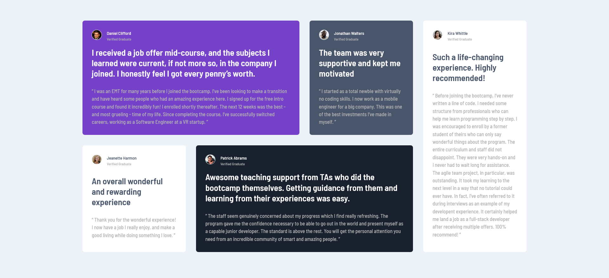

# Frontend Mentor - Testimonials grid section solution

This is a solution to the [Testimonials grid section challenge on Frontend Mentor](https://www.frontendmentor.io/challenges/testimonials-grid-section-Nnw6J7Un7). Frontend Mentor challenges help you improve your coding skills by building realistic projects. 

## Overview

### The challenge

Users should be able to:

- View the optimal layout for the site depending on their device's screen size

### Screenshot

### Links

- Solution URL: [Github](https://github.com/Shahzaib-ur-Rehman/testimonials-grid)
- Live Site URL: [Live Site URL](https://testimonials-grid-rosy.vercel.app/)

## My process

### Built with

- Semantic HTML5 markup
- CSS custom properties
- Flexbox
- CSS Grid
- Mobile-first workflow

### Useful resources

- [custom-css-reset](https://www.joshwcomeau.com/css/custom-css-reset/) - Reset CSS
 
## Author

- Website - [Shahzaib](https://www.linkedin.com/in/shahzaib-ur-rehman-2518b01b8/)
- Frontend Mentor - [@Shahzaib-ur-Rehman](https://www.frontendmentor.io/profile/Shahzaib-ur-Rehman)
- Twitter - [@Shaahziab](https://twitter.com/Shaahziab)